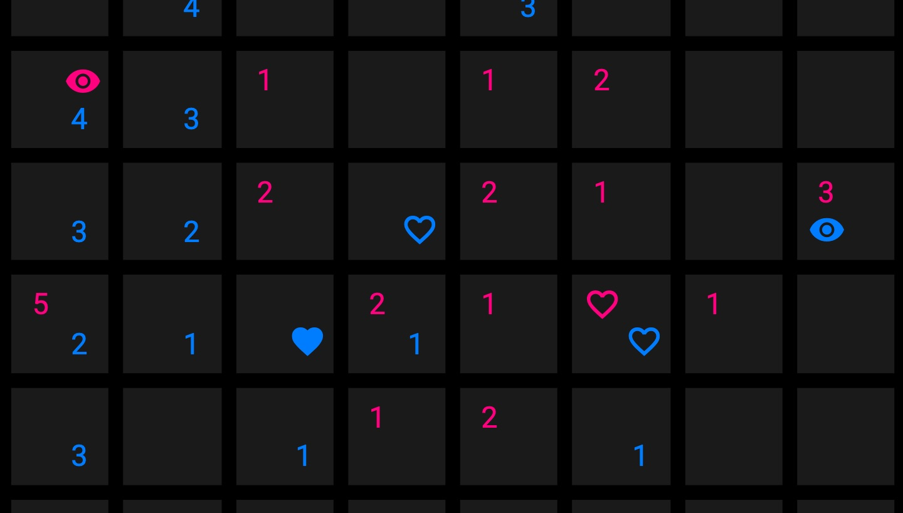

# 鼓動をつかったゲームのテストプレー

心臓の鼓動を用いたゲームデバイスを制作するにあたり、テストプレーとして操作を体験していただける方を募集します。

わたしたちは他者から見られる外面を意図的につくったり、隠したりして生活しています。そのいっぽうで、身体の内面は自分の意志で変化させたり、止めたり、偽ったりすることができません。

もし他者の鼓動を感じることができるなら、そこからなにかを読み取ることはできるのでしょうか？

[[toc]]

## なにをするの？

- 専用のコントローラを使い、コンピュータを介して対戦型のゲームを2回プレイします。
- 1回目は通常のテーブルゲームです。2回目は、コントローラを通じてあなたの心拍の変動を計測し、お互いに相手の鼓動を見られる状態でプレイします。
- コントローラは手で持つだけでデータを読み取ります。装置を体に刺したり、固定したりすることはありません。
- 終了後、アンケートと簡単なヒアリングにご協力ください。
- 全体の所要時間は20分程度です（と思っています）。

## どんなゲームなの？

**「海戦ゲーム」** と呼ばれる古典テーブルゲームを元にしています。

- 2人のプレーヤは、それぞれ自分の陣地にコマを配置します。
- プレーヤは交互に相手の陣地を攻撃し、見えない相手のコマを当てることを目指します。
- 攻撃が外れても「相手のコマまでどれくらい近かったか」がわかるため、攻撃の場所は徐々に絞り込まれます。
- 先に相手のコマの場所をすべて当てた人が勝者です。

[Wikipedia「海戦ゲーム」](https://ja.wikipedia.org/wiki/%E6%B5%B7%E6%88%A6%E3%82%B2%E3%83%BC%E3%83%A0)もごらんください。

## なぜこの研究をするの？

わたしたちの身体をメディアに取り込み、新しいコミュニケーションを作り出そうという試みは、多くの人によって取り組まれてきました。

鼓動・呼吸のリズムや体温を使ったコミュニケーションは、多くの人が思いついたアイデアです。技術的にはさまざまな方法によって簡単にこれらのデータを得ることができますが、実際に他者とそのデータを共有してみると、当事者が生理的な拒否感を覚えるケースが多く生じます。

身体の内面的なデータがもっとも情報を伝えるのは、それが身体の外面的な印象と異なる情報を伝えるときです。しかし、多くの場合それは怒りや緊張など、本人がそれを伝えることを望まないシーンでした。上にあげたような身体が生み出すデータは自力で制御することができまないため、このような場面では多くの人がそれを他者に伝えることを拒むと報告されています。無理なく活用できるシーンは存在しないのでしょうか？

この研究では、先行研究で指摘された「ゲームプレー」のシーンに着目し、生体信号を活用する可能性について検討しています。ここでは、従来のように相手の外面からだけでなく、相手の内面を読み取ることが、ゲームを有利に進めることに役立つ可能性があります。効果は単なるゲームの勝敗にとどまらず、コミュニケーションそのものに思いもよらない形で現れるかもしれません。

## 研究情報

**「生体信号を用いたコミュニケーションの可能性検討」** 心理戦ゲームにおける鼓動情報の活用​

筑波大学 情報メディア創成学類 グラフィックデザイン研究室 稲田和巳 <s1711429@s.tsukuba.ac.jp> / [@nandenjin](https://twitter.com/nandenjin)

- 実験で得られたデータは匿名化した上で研究目的のみに使用し、他の用途に使用することはありません。
- 実験への参加は本人の意志に基づいてのみ行われます。あなたはいつでも実験への参加を中止することができます。
