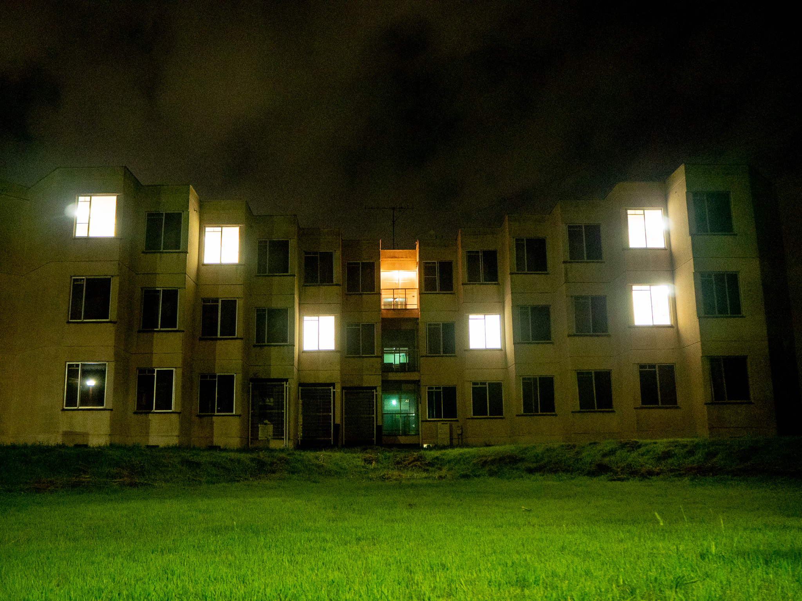

# 《住人たち》再展示にかかる《住人》を募集します

2019 年に制作した作品《住人たち》の再展示にともない、作品の一部となる住人（協力者）を募集します。

[[toc]]

## 《住人たち》について

この作品は、使われなくなった建物の窓の明かりを、実際に生活する人々の住処の明かりと連動させることで、人々が成す社会の動きを観察することを試みたインスタレーション作品です。2019 年に開催された芸術展「[平砂アートムーヴメント ここにおいて みせる／みる](https://www.nandenjin.com/events/ham19)」で制作し、筑波大学の学生を対象にデータを集めて展示しました。

この展示で使用した建物は筑波大学平砂学生宿舎の 9 号棟で、老朽化し使用停止になっていました。展示にあたっては各部屋に電灯を切り替える装置を設営し、協力者である《住人》たちの自宅から送られてくる明かりのデータを、インターネット回線を通じて集めて使用していました。また、自分の生活の様子に関するヒントを《住人》たち自身が書いたコメントを公開することで、匿名ながらもその存在が鑑賞者たちへに伝わるように計らいました。

- [住人たち 作品詳細](https://www.nandenjin.com/works/residents)
- [建物の明かりをハックする「住人たち」「カリヨン」ができるまで](https://note.com/nandenjin/n/n4e357d12a5ff)

今回募集するのは、この 2019 年の展示を同じように再現するにあたり、9 号棟に「住んで」いただける協力者です。

## 《住人》としてお願いすること

### 要件

- **筑波大学に在学する学生であること**
- **自分の住処で以下が使用できること**
  - USB 接続ができる PC（Windows / MacOS）
  - 無線 LAN でのインターネット回線
- **明かりの様子を公開することで生じるリスク（後述）を理解していただけること**

### やってもらうこと

- **《カギ》の設置:** 《住人》たちの住処の明かりを収集しているのは、この作品で《カギ》と呼んでいる、9 号棟の部屋につながるための専用のデバイスです。
  - PC を使って無線 LAN のセットアップをおこない、自分の住処に設置してください。
  - 一度セットアップすると、なにもしなくても動作し続けます。
  - マイク・カメラ等の搭載はなく、周囲の明るさ以外の情報を収集することはありません。
- **自分の生活に関するコメントの提供:** 鑑賞者が各部屋に住んでいる人の生活を想像できるようなコメントを提供してください。
  - 例えば、2019 年の展示では以下のようなコメントを頂きました。

> なんでも夢中になったら止まらない。ヘトヘトで帰ってきて、そのまま電気を消さずに寝てしまうことも。夜はまだまだ長い。

> 頑張って大学に出ようとしているが午前は起きられない。だいたい電気をつけっぱで寝てしまう。

> 家族で住んでいます。この部屋に家族で住むのは少し窮屈ですね...
> 昼間に明かりがついていれば母がいるかもしれませんし、
> 夜中まで明かりがついていれば私が必死の形相で課題に取り組んでいるかもしれません。

### 期間

- 展示期間 **2021/11/23〜28**
- この前後を含む期間で《カギ》を設置してください。

### リスクについて

この展示では**誰がどの部屋に「住んで」いるのかは全くわかりません**（作者である稲田にもわかりません）し、そのようなことがわからないよう考えうる限り対策を講じています。しかし、《住人》自身の言動や公開するコメント、そして展示している明かりの明滅パターン自体によっては、 **それが誰かに予期せずわかってしまうことがありえます。** 2019 年にはそのような兆候はありませんでしたが、ご参加いただける場合も、これを十分にご理解ください。

## 参加登録

大学内の Microsoft Forms から登録が可能です。登録後、こちらからご連絡さしあげます。

デバイスの個数にも部屋の数にも制約があるため、登録いただいても参加を確約できるわけではないことをご理解ください。

- [**登録フォーム**](https://forms.office.com/Pages/ResponsePage.aspx?id=_V1bnp1m-E6yQEIpy_SoPd8j15umkAxCjIlnexRDG2ZUNEJUVDFPRkFUOUVTSzI2VjY1WlJWS0pWWS4u)

みなさまのご参加をお待ちしています。

## 問い合わせ

本件について不明点がある場合は、お気軽にどうぞ。

- Email: `hello@nandenjin.com`
- Twitter: [@nandenjin](https://twitter.com/nandenjin)
- 筑波大学 Teams: `s2121607@u.tsukuba.ac.jp` で検索
