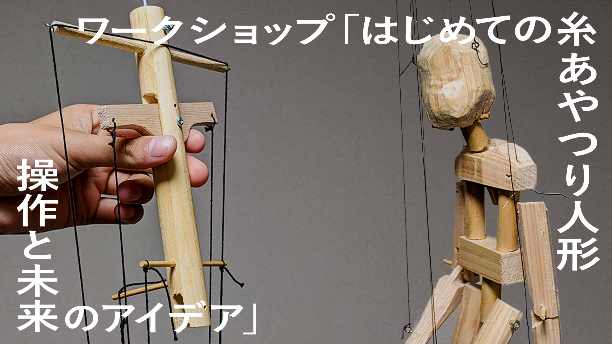
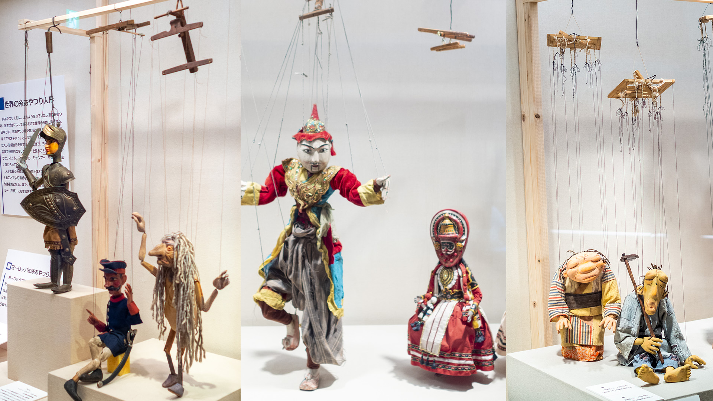
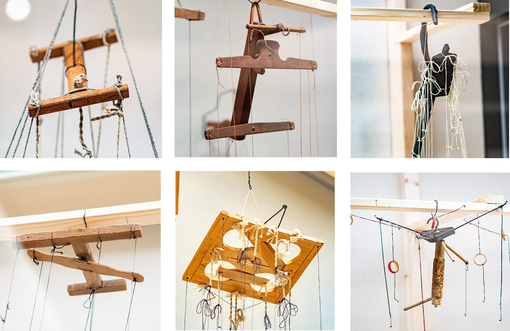

# ワークショップ『はじめての糸あやつり人形 操作と未来のアイデア』

**2022/12/5 (月) -** ~~12/12 (月)~~ **12/14 (水) 開催予定**

糸で操る人形を操作する体験ができるワークショップです。操作方法が日本式・西洋式と異なる人形の操作を体験しながら、操作方法の違いやコツ、社会で応用するアイデアについて考えます。

どなたでも参加いただけます。複数名での参加も歓迎です。

[**申込み／連絡先登録**](https://docs.google.com/forms/d/e/1FAIpQLSdByrmJk9TaJDkhFtVF8QkMW8GdfiCtimGzR-JVR_OeH3nrRw/viewform)

[[toc]]

## ワークショップ内容

- 糸あやつり人形や人形劇文化についての簡単な解説ののち、**実際に人形を持って操作する体験をします。**
  - 西洋式・日本式の 2 種類のコントローラを使い比べます。
  - 糸あやつり人形は、自分が操作している人形を間近に見ることができません。このため、1 人が操作し、もう 1 人がアドバイスをする、グループワークを行います。
- 体験ののち、感想や意見を交換する時間を少し取ります。

全体で **45 分～ 55 分程度** を予定しています。

## 参加するには

経験や知識を問わず、どなたでも参加いただけます。

- 参加は無料ですが、事前の申し込みが必要です。
- 開催候補日のうち、2 名以上の参加希望があった回を開催します。回ごとの定員は 4 名です。
- **複数の回に同時に申し込むことができます。** 開催が決定した回についてご案内を差し上げます。
- **複数人でいっしょに参加することができます。** 申込みフォームの人数欄にご記入ください。
- **参加できる回がなくてもフォームに記入できます。** 開催回の追加や、今後同様のイベントがある際にご案内します。

[**申込み／連絡先登録はこちら**](https://docs.google.com/forms/d/e/1FAIpQLSdByrmJk9TaJDkhFtVF8QkMW8GdfiCtimGzR-JVR_OeH3nrRw/viewform)

筑波大学内での参加を想定していますが、学外からの参加ご希望があればお問い合わせください。

<iframe src="https://docs.google.com/spreadsheets/d/e/2PACX-1vSetPzclSJG6IbUR-mwoEdo5jAyAYl_On2Ewdy3gBwAcTj12jsgzNd23__nidYsxufWvCFz6SEONS9V/pubhtml?gid=0&amp;single=true&amp;widget=true&amp;headers=true" style="width: 100%; height: 350px; border: 1px solid #ddd; border-radius: 10px; "></iframe>

[**申込みフォーム**](https://docs.google.com/forms/d/e/1FAIpQLSdByrmJk9TaJDkhFtVF8QkMW8GdfiCtimGzR-JVR_OeH3nrRw/viewform)をごらんください。質問・相談は、最下部の連絡先や[Twitter:@nandenjin](https://twitter.com/nandenjin)、筑波大学 Teams `稲田和巳` へお気軽にどうぞ。

## 人形に込められた世界中の知恵

ワークショップの背景にある文化と考え方についてご紹介します。

もっと知りたい

糸あやつり人形は幾本もの糸を使って人形を吊り、舞台の上から自在に操る形式の人形劇です。人形から伸びる糸は遣い手の指に直接繋がるのではなく、糸をまとめる器具「コントローラ」に繋げられ、遣い手はこれを手に持って操作します。

コントローラは世界各地の文化の中で独自に発明され、改良され続けてきました。現在も各国で使われるそれを見比べると、全く異なる形、操法であるのがわかります。世界中で使われる多様なコントローラは、多数の関節を持つ人体のモデルを手先だけで操作するための、それぞれの文化における知恵が詰まった発明品であると言えるでしょう。もしかすると、人形劇を離れて、もっと活用できる場所があるかもしれません。

このワークショップでは、さまざまなコントローラの形態のうち、国内でもよく見られる 2 種類を実際に使って、どのように操作ができるのかを体験できます。また、コントローラに込められた知恵が、現代の社会で応用できる場所はないだろうか？というアイデアについても考えます。

（画像: 吹田市博物館「出口座と坂本一房」展より、稲田撮影）

## 実験について

このワークショップは、筑波大学大学院 情報学学位プログラム グラフィックデザイン研究室の研究の一環で行う実験です。内容については、図書館情報メディア系倫理審査委員会の許可を得て計画しています。

不明な点は以下へお問い合わせください。

- 稲田和巳（情報学学位プログラム 博士前期課程 2 年） s2121607 ◯ s tsukuba ac jp
- 金尚泰（図書館情報メディア系 准教授）pacman ◯ slis tsukuba ac jp
