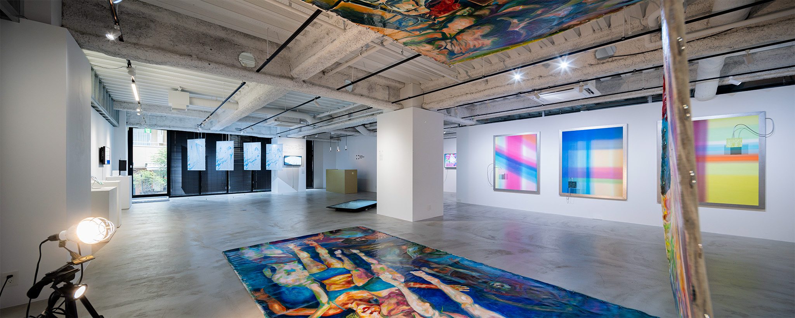

# クマ財団クリエイター奨学金 採択されるまで・されてから

2023年度、[公益財団法人クマ財団](https://kuma-foundation.org/)の[クリエイター奨学生（7期）として採択いただいています。](https://kuma-foundation.org/student/kazumi-inada/)奨学生の活動としてひと区切りであるグループ展の開催を機会に、採択いただくまでの過程と奨学生としての活動についてレビューします。

_本記事は稲田が個人の情報発信として執筆し公開しています。記載内容は財団や関係者の公的な見解を示すものでないことをご承知おきください。_

## 財団と支援内容について

### クリエイター奨学金

[https://kuma-foundation.org/scholarship/](https://kuma-foundation.org/scholarship/)

25歳以下の「クリエイター」を対象とした奨学金制度。2017年度から開始し、2023年度で7年目を迎えます。10万円/月を1年間 = 総額120万円の給付 + 展示や交流機会の提供を年間30〜70人に対して続け、いまではよく知られたクリエイター支援制度になりました。条件を満たし審査をパスすれば、そのまま次年度も「継続生」として活動を続けられるシステムもあります。

本稿はこのクリエイター奨学金制度の体験談です。

### 活動支援

[https://kuma-foundation.org/support/](https://kuma-foundation.org/support/)

プロジェクトベースで採択をおこなう助成金制度です。助成金額は30〜500万円。2021年から新たに始まった比較的新しい事業で、クリエイター奨学金に比べれば知名度が低いと思われます（稲田も奨学金に受かるまで把握していなかった）。申請できるのがクリエイター奨学金制度の卒業生だけなので、奨学金制度と一具のものとして考えるべきです。

## 特徴

稲田がわかる美術系アワードや奨学金制度の領域と比べて特徴的な点を列記します。

- **ジャンルの要件がない。** 応募要項には29種類のジャンルが記載され、奨学生のプロフィールも概ねこれに従って分類されてこそいますが、これだけの数があればほぼ自由と考えて良いでしょう。
- **アワードではなく奨学金である。** クリエイター・アーティストが応募できるものとしてはアワードのほうが目立ちますが、クマ財団のそれは奨学金制度です。作品ではなく人を審査しており、また採択されると合宿等のカリキュラムを受講することとなります。
- **個別領域へのサポートが薄い。** 個人の制作に対するサポートは特になく、カリキュラムとして設定されているのはコンセプト設計や展示といった全員共通のサポートのみです。多様なジャンルを受け入れることの裏返しでもあります。
- **設立者が積極的に関わっている。** クマ財団の設立者・理事長はゲーム会社のコロプラの創業者・[馬場功淳](https://ja.wikipedia.org/wiki/%E9%A6%AC%E5%A0%B4%E5%8A%9F%E6%B7%B3)さんですが、キックオフに来場されたり、成果展には必ず足を運び作家全員と話されていたりと、事業に積極的に関わっておられます。
  - 財団の出資が寄付金ではなく、おそらくはコロプラの事業配当で成り立っている[^1]のも注目すべき点だと思います。
  - 単に文化への投資を行うだけの実業家もいる中で、自身もクリエイターである設立者の矜持と熱意が伝わる、奨学生目線ではとてもありがたい存在でした。

<figure>
  
  <figcaption>応募要項に示されている29種類のジャンル</figcaption>
</figure>

## 選考について

### 応募要項を読む

[応募要項の原文はこちら。](https://kuma-foundation.org/scholarship/guideline/)毎年同じページを上書きしてしまっていますが、[Wayback Machineで過去3年分くらいは遡ることができ](https://web.archive.org/web/*/https://kuma-foundation.org/scholarship/guideline/)、またPDF版はURLの連番を打ち替えることで過去4年分を参照できます[^2]。

#### 応募資格・審査基準

応募資格は25歳以下の学生（大学生・大学院生相当: 高専・短大・専門学校を含む）のクリエイター（を目指している者）とあります。特にクリエイターについては以下のように但し書きがあります。

> クリエイターを目指し創作活動をしている者。**未開発な領域に挑戦し、新しい価値を創造しようとしている者。伝統から新たな価値を創ろうとしている者。** （強調は筆者）

さらにそのすぐ下には選考基準があり、審査項目として「ビジョン」「チャレンジ」「パッション」「アクション」「インフルエンス」の5項目が示されています。

それぞれの中身は[原文で確認してほしい](https://kuma-foundation.org/scholarship/guideline/#:~:text=%E3%81%A8%E3%81%97%E3%81%A6%E3%81%84%E3%82%8B%E8%80%85%E3%80%82-,%E9%81%B8%E8%80%83%E5%9F%BA%E6%BA%96,-%E3%82%AF%E3%83%9E%E8%B2%A1%E5%9B%A3%E3%81%A7%E3%81%AF)のですが、前項も合わせて、特に未開発な領域におけるチャレンジの重視や、製作技術だけではない、行動力・発信力といった、いわば社会へのアプローチ能力も考慮されていることがわかります。

#### 選考方式

選考は書類審査 -> 最終審査（面接）の順で進むことが募集要項で明らかにされています。書類審査はオンラインフォームに入力する形式で、思いのほかたくさん入力欄があります。

特に大変と思われる自己アピールのフォームは以下（2023年度の例）のようにちょっと独特な質問をしており、しかも毎年ちょっとずつ内容が変わっています。過去に応募した人や普段からアピール文のテンプレートを作っている人でも、使い回しは難しいかもしれません。

> - クリエイターとしての制作や活動の内容について具体的に記載してください（800字程度）
> - なぜ上記のような創作活動を行っていますか？（400字程度）
> - 上記の活動や作品を通じてどのような「新しい価値」を提示または模索していますか？（400字程度）
> - クマ財団7期生として1年間どのような活動をしたいですか。（400字程度）
> - 学内での勉強内容、ゼミ、専攻、研究テーマ等をご記載ください

選考委員は以下の5名の先生です（肩書・所属は稲田が調べて付した）。なんとなくですが稲田は、作家というよりもディレクター・プロデューサーのみなさん、という雰囲気を感じました。

- 森山 貴裕（クリエイティブディレクター）
- 星野 准一（研究者・筑波大学システム情報系）
- 押元 一敏（画家・東京藝術大学デザイン科）
- 小林 大介（プロデューサー・PARCOエンタテインメント事業部）
- 久保 哲朗（作曲家・洗足学園音楽大学）

#### 応募人数と倍率

採択人数の目安は少ないときで40人・多いと80人と年によってかなり幅があります。実はこれに対するエントリー実績数も一部公表されており[^3]、ここから算出できる採択倍率は概ね40〜50倍程度。これもレベル感の指標として使えそうです。

| 年度 | 募集人数 |   応募数 | 採択人数 | うち継続採択数 | 新規採択の倍率 |
| :--: | -------: | -------: | -------: | -------------: | -------------: |
| 2021 |       80 | 非公表？ |       71 |             14 |            N/A |
| 2022 |   60[^4] |     1655 |       55 |             11 |           37.6 |
| 2023 |       40 |     1466 |       36 |              6 |           48.9 |

募集には前期・後期があり、前期で不合格になると同じ年の後期で再応募はできません。分かれている理由については稲田もよくわかっていません（稲田は後期採択）。単に人数をさばくための負荷軽減ということでしょうか……。

### 稲田の場合

#### エントリー

稲田は2023年4月時点で25歳で、応募可能な最後の年です。調べたところ応募はこれで4回目（2020年から毎年）でした。

ここまで3回それなりに時間をかけて書類を準備し全部書類時点での選考落ち、当然これに対するフィードバックは何ら得られません。不埒にも「大きめの実績ができれば通るのでは？」と思ったりもしたのですが、[CAF賞](https://www.nandenjin.com/news/211128_caf21_award)の実績が入ったあともやっぱり変わらず。稲田の有り体な感想は「書くのが面倒なのに手応えがないやつ」、正直言ってそろそろ嫌になりながらのエントリーではありました……。

#### 追加面接

なんだかんだ言いながらエントリー文章の中身の方向性を毎年変えることで選考担当者に「刺さる」書き方のテストはしており、それが今年は当たったのか、次に進むことが出来ました。ただし選考フローにある最終面接ではありません。

> この度は、クリエイター奨学金にご応募いただき、ありがとうございます。 
> 書類選考を経て、提出書類のみでの合否判断を致しかねるため 
> 稲田様には追加での面談を実施させていただければと思います。

面接はオンライン、相手は（このときは知りませんでしたが）事務局のスタッフさんたちでした。内容はあまり事細かに喋るわけにはいけないのですが、ポートフォリオとして提出した取り組みの相互の関係性や、制作コンセプトにおける言葉の定義を聞かれたりとか。なお、少なくとも去年も応募したことはバレてました。

面接担当のスタッフさんの「聞き出す力」が高く、助けられたというか頼りっぱなしだったので本当にすごいなと思います。が、のんきに感心している場合ではなく、要は稲田の文章ではここで聞かれたような重要な要素が説明できていない、ということに他なりません。ドキュメンテーションやオープン化を標榜している身としては正にクリティカルヒットです。反省。

#### 最終面接

なんとか追加面接をパスして最終選考です。こちらもオンラインでの実施で、15分の時間のうち、冒頭3分だけ自分でプレゼンする時間が与えられます。追加面接での反省を活かして、答えられなかったことのメモを作って参加しました。

質問はこれも作品のジャンル的位置づけやコンセプトへのツッコミ、クリエイターとしてのスタンスについてなど。5名の選考委員が全員参加されていますが、おそらく喋る人は事前に決まっているようで、稲田のときは2人だけ（森山先生・星野先生）から質問がありました。

ちょっと意地悪目に聞いてるかな？という感触で、どうにか詰まらず食い下がることには成功したと思うのですが、答えが的確だったかは微妙です。質問者の知識と頭の良さをガンガンに感じるやりとりでした。

#### 所感

- **選考は非常に丁寧に見られている**と感じました。質問の的確さ（自分が聞かれたくないなと思っているところをズバリ聞かれたりする）もそうですし、先生方は選考後もしっかりそれぞれのことを覚えてくださっています。奨学生になってから選考委員の先生と話す機会が何度かありましたが、名乗るだけで過去の作品についてすぐに思い出して評していただくなど、本当に長い時間をかけて見ていただいたことを感じます。
- **選考形式について。** 最終選考の尺を考慮すると、どう計算しても書類審査だけで少なくとも20倍程度の倍率があることが推察されます。作品紹介のみならずかなりの量の文章を書かないといけず、**最初から言語化の能力が強く問われる**という点で難しい課題だと思います。一方で、作品よりも人を見られていること、選考基準が明示されていることが分かれば対策も立てやすいかもしれません。

蛇足ですが、稲田が以前より「この幅広いジャンルのクリエイター集団を審査している選考委員は、カバー範囲がまんべんなくなるように選出されているのか、それともめちゃくちゃカバー範囲が広いお化け人間なのか」ということが疑問でした。直接何度かお話して、現時点での結論は後者です。ぜひ最終選考までチャレンジしてみてほしい。

### 様々な人のことば

本記事は選考委員や事務局、その他さまざまな関係者の人々から稲田が聞いたことをもとに執筆しています。ここまでで述べきれなかったものも含め、特に面白いヒントだなと思ったコメントをいくつか意訳でご紹介します。

- 採択後のサポートが特にない、放置タイプのカリキュラム。ほっとかれても自走できる人かは重要
- 社会に影響を与えることができるか、ということも指標のひとつ
- 審査で実績は考慮してない。作品を見て良否が判断できない場合に初めて見る
- 過去の奨学生と比べて同じレベルになるかどうか検証する。結果として定員より採択数が少なめになる
- 継続生は毎年新しいことに取り組み続けている
- せっかく助成をするので、採択後もさらなる伸びを期待する

## 採択されて

すでにここまででも十分な分量の記事なのですが、せっかくなので採択いただいて以降のことについても述べたいと思います。

### 雰囲気

一言でいうと「若くて元気」。年齢制限があり、例えば大学院に再入学した年長者などがいないこと、また事務局やスタッフにもOBOGがいたりすることなどもあってか、全体的に学生界隈の、ざっくばらんで活き活きした雰囲気を感じます。

奨学生はみんな必然的にコミュニケーション能力の高い人が揃うのも一因ではないかと思います。みんな話しやすく、会話を続けるのが上手です。（稲田はこれ苦手な方なので感心しっぱなしでしたし、時々死にかけていました😇）

### カリキュラム

実際にやってみると、全体で動きみんなで会う機会というのは思いのほか少ないです。同じ採択生でも人によっては一期一会になりかねないくらい。

- **キックオフ（7月）:** 奨学生全員で都内に集合します。初手のイメージは「人数が多い」。7期生は36人ですが、自己紹介を1人1分で回しても1時間です（もっと人数多い期はどうしてたんだろう……）。お互いがお互いのことをなんとなく認識したあたりで解散になりました。
- **合宿（8月）:** 箱根某所で全員参加・3日間の合宿があります。移動を抜くと実質2日間、冒頭でグループ展のメンバー分けが発表され、缶詰状態でコンセプト・タイトル・会場レイアウトなどを決めて発表します。地味に奨学生が全員揃う最後の機会であり、消灯後もロビーに集まって夜更けまで喋っている学生が多かったです。
- **グループ展（10〜3月）:** 6人ずつ、六本木の国立新美術館近くにある財団所有のギャラリーでグループ展を開催します。別途詳述。

<figure>
  
  <figcaption>合宿（KUMA CAMP）でのセッションの様子</figcaption>
</figure>

### グループ展

クリエイター奨学金制度では、対外的な成果発表として毎年グループ展を開催しています。以前は数十人単位での大規模展でしたが、六本木の[クマ財団ギャラリー](https://kuma-foundation.org/gallery/)がオープンした2022年以降は数人単位（今年は6人×6回）でのグループ展になっています。

<figure>
  
  <figcaption>現在開催中の11月会期のグループ展。稲田の作品は左奥の水色</figcaption>
</figure>

グループ展に関しては、奨学生として求められるポイントが2つあります。

- 発表作品は原則新作であること。
- 発表形態は美術展であること。

特に2つめはたいへん重要で、奨学生のなかには作曲・文芸・テクノロジーといった、発表形態が作品展示ではない人もそれなりにいるわけですが、どうにかして美術展のコンテキストに落とし込む必要があります。また最初から展示をするタイプの人も、**なんにもせずに既作の展示だけやって1年を終えることは許されない**わけです。

先述の合宿が終わったあとは各チームで連絡を取り合いながら準備を進めます。各チームには展示づくりのコーディネーター担当がついてもらえるほか、設営時にはインストーラー（設営技術者）をつけてもらえます。

<figure>
  
  <figcaption>合宿の解散後、クマ財団ギャラリーを下見に行ったときの様子（展示中の作品は<a href="https://kuma-foundation.org/gallery/event/fangzhouyuan/" target="_blank" rel="noopener">袁方洲『くろの結界 The boundary of black』</a>）</figcaption>
</figure>

#### 実際にやってみた

稲田は11月会期のBチーム所属で、現在展示が開催中です。きちんと展示として成立した光景になっていますが、ここまでスムーズに進んだかというと全くそんなことはなく……。やはり学生集団らしい仕事加減と、あとメンバー分けがほぼランダム（≒ ノーキュレーション）であるがゆえのカオスな様相を呈しました。

ただまあ、なんだかんだ言ってもやはり激戦を勝ち抜いたハイスペック作家たちなので、作品は本当にしっかり上がってくるし、展示も形式上はきっちり仕上がります。すごい。

<figure>
  
  <figcaption>会期前日のレセプションで開催した、<a href="https://kuma-foundation.org/student/yuri-umemoto/" target="_blank" rel="noopener">梅本佑利</a>作曲の作品の演奏パフォーマンス。手前の床面は<a href="https://kuma-foundation.org/student/hina-shibata/" target="_blank" rel="noopener">芝田日菜</a>の映像作品</figcaption>
</figure>

### 継続生

稲田は年齢上限ギリギリで通っているのであまり意識にないのですが、年度末が近づいてくるにつれ、みんななんとなく継続採用のことが気になっているような雰囲気を感じます。

継続申請について詳しいことは特に明らかにはなっておらず、稲田も経験してないので下手なことは言えませんが、たとえば同じく奨学生を対象にする[活動支援事業の選考基準](https://kuma-foundation.org/support/guideline/#:~:text=1%E6%9C%88%E4%B8%8B%E6%97%AC-,%E9%81%B8%E8%80%83%E5%9F%BA%E6%BA%96,-%E6%9C%AC%E9%81%B8%E8%80%83%E3%81%AF)には

> - 奨学生期間の活動内容や活動結果（過去の年間カリキュラムへの参加、展覧会での作品発表内容）
> - 過去の受賞歴、応募歴等対外的評価を受けているか（客観的評価や創作への意欲）

があり、こういうところが評価対象になるのではないかなと想像しています。実際、継続生は展示のワーキンググループを率先してリードしていたり、コンスタントに成果を上げていたり、新しいことに取り組んでいたりと、明らかに突出して活動していると感じます。

### 奨学生としてのここまでのまとめ

#### 良かったところ

- **充実した支援と環境:** 個人の分野特化な技能は自分でどうにかしないといけないという了解があれば、資金の心配なくさまざまな体験をし制作ができる、レベルの高い人と交流できる、発表の機会がある、いずれもとても恵まれていると思います[^5]。（ありがとうございます）
- **関わりのない分野の人と交流ができる:** 前項とも被りつつも特に推したい点です。こうでもなければ話さないようなジャンルの人たちとも対等につながってじっくり話せるのは、やってみないとわからない充実感があります。
  - グループ展のメンバー分けに特にキュレーションがないことには賛否あると思いますが、奨学生の視点だけ考慮するならば結果的に悪くはなかったと感じます。
- **設立者の熱量:** [特徴](#特徴)で述べた通り、設立者がクリエイターであること、熱意を持って運営に関わっていることも特筆すべき点であると思います。

#### 難しいなと思ったところ

- **展示コンテクストでない人へのサポート:** 成果発表が展示でないといけないのは、普段そういうことをしない人にとって最難関でしょう。こういう人へのサポートはもっと手厚くあるべきだと思いますし、可能な限りそれぞれの得意なフィールドで発表ができればいいなと思います。
  - ある程度までは当人の努力次第であるとも思っています。10月期参加の[山名さん（テクノロジー / 5-6-7期）](https://kuma-foundation.org/student/takuto-yamana/)の展示がとても上手だったので個人的にお伺いしたところ、「去年クマ財団ギャラリーでやってた展示10会期くらいを全部見に行った」とのことです。納得だし本当に感嘆してしまった。
    - なにかしらのスタイルに統一して、誰かにこういう努力をしてもらう必要があるという前提に立つと、美術展というスタイルはわりと汎用な最適解かもしれないとも思います。
- **フリーライダー問題:** 合宿や展示での新作発表など、奨学生としての義務に対してどれくらいの積極さで関わるかはそれぞれで、これだけの選考を通ってきた人でも、あからさまにコミットする気がない人（フリーライダー）もやはり一定数いるようです。選考って難しいんだなあ……と思いました……[^6]

## まとめにかえて

われわれ11月（Bチーム）のグループ展は、11月26日（火水休廊）まで開催中です。六本木駅から徒歩4分、国立新美術館から徒歩2分。それ以降も7期生のグループ展は3月期まで続きます。ぜひお越しくださいませ。

> [KUMA Experiment 2023-2024 Vol.2 "ASTERISM"](https://www.nandenjin.com/events/asterism) 
> 2023年11月11日（土）〜 11月26日（日） 
> クマ財団ギャラリー（六本木） 
> 12:00-19:00 火・水曜休廊 

本記事は無償で公開しています。もしよろしければ[note掲載の各記事](https://note.com/nandenjin/n/n6edd7cecdb2e)の最下部にあるサポートボタンや、[ArtSticker](https://artsticker.app/artists/2184)・[SUZURI](https://suzuri.jp/kzmi)からの商品購入でご支援いただけると喜びます。

[^1]: 財団の収入のあり方は[会計資料](https://kuma-foundation.org/disclosure/)から参照することができます。
[^2]: Web版: [2021年度](https://web.archive.org/web/20210921014843/https://kuma-foundation.org/scholarship/guideline/), [2022年度](https://web.archive.org/web/20220119223200/https://kuma-foundation.org/scholarship/guideline/), [2023年度](https://web.archive.org/web/20230409123926/https://kuma-foundation.org/scholarship/guideline/)。PDF版:[2020年度](https://web.archive.org/web/20231117101305/https://kuma-foundation.org/files/pdf/guideline_001.pdf), [2021年度](https://web.archive.org/web/20231117165315/https://kuma-foundation.org/files/pdf/guideline_002_sp.pdf), [2022年度](https://web.archive.org/web/20211202103353/https://kuma-foundation.org/files/pdf/guideline_003_sp.pdf), [2023年度](https://web.archive.org/web/20221207231057/https://kuma-foundation.org/files/pdf/guideline_004_sp.pdf)。
[^3]: 2023年度だと[採択リリース](https://kuma-foundation.org/news/9008/#:~:text=%E3%81%BE%E3%81%97%E3%81%9F%E3%80%82%0A%E3%81%93%E3%81%AE%E5%BA%A6%E3%80%81-,%E3%82%A8%E3%83%B3%E3%83%88%E3%83%AA%E3%83%BC%E6%95%B01%2C466%E5%90%8D,-%E3%82%88%E3%82%8A%E9%81%B8%E8%80%83%E3%82%92)に掲載されている
[^4]: 2022年募集要項の募集人数は、Wayback Machineのキャプチャ時期によって[60〜90名程度と書いてあったり](https://web.archive.org/web/20211230095449/https://kuma-foundation.org/scholarship/guideline/)、[80名と書いてあったり](https://web.archive.org/web/20211202095106/https://kuma-foundation.org/scholarship/guideline/)しますが、ここでは[最終版](https://web.archive.org/web/20220119223200/https://kuma-foundation.org/scholarship/guideline/)の数字を採用しました
[^5]: 金額が十分かは違う意見の人もいたので人や場所によるかもしれない。稲田は大学院生としても別途支援をいただいてたりすることを念の為断っておきます。
[^6]: 奨学生は「参加状況が悪くてNGが出されたら奨学金を全額返還する」（意訳）という誓約書を書いているため、フリーライダーがBANされる事態がないわけではないそうです。実際に発動した例があるかは知りませんが、発動する寸前まで行ったという例は耳にしました。
