# 歩く歩くの会 近況

この記事は[附天OBOG Advent Calendar (AFTAC) 2023](https://adventar.org/calendars/9428) 4日目の記事です（[`@ChinChanTwo`](https://twitter.com/ChinChanTwo/status/1727329091010138243) 今年も設置ありがとうございます）。

昨日までは、毎日のように作業通話を繋いでいる中高同期の[ぐちさん](https://twitter.com/Mt_Guchi03)の記事でした。バックナンバーをアドベントカレンダーと称して投稿するのはアリなのか？（煽り）という疑問はありつつも、彼の記事は阪大工学部の公式ブログで毎回圧倒的なPV数を誇っているそうなので侮れません。文字数チャレンジえげつねえな。

今日はいまだに山の辺の道を夜な夜な散歩しているという話をします。

## 自己紹介

中64期-高58期。中学映像部、高校演劇部（現存せず）、舞台発表委員会・音選発表で撮影・音響・照明などテクノロジーをやっていました。小講堂の天井についている舞台用照明は、稲田が仕様を好きに書かせていただいてつけていただいたものです。また41回百粁ではP副隊長、42回ではM1隊長（総隊長）やマップ制作を担当しました。

卒業後はｽﾝﾀﾞｲ学に進学したのち筑波大の情報メディア創成学類に入学し、なんだかんだあっていまは博士課程1年をやっています。

附天から筑波大に進学する人はなかなかおらず、いたとて最近は期が離れすぎていて追跡できなくなってしまいました（同じ情報系にもうひとりいるらしいのに……）。SSHのつくば研修で泊まる宿が現自宅のものすごい近所なのですが、これも高校といまいちうまい連絡ルートがなく逃しまくっています。さみしい。でもまあ元気にやっています。

## 歩く歩くの会とは

42回（2014年度）・43回（2015年度）くらいの百粁関係者がゆるっと集まっている界隈があり、不定期にどこかに歩きに行く会をしています。「歩く歩くの会」という名称は、59期のM氏が使ってた呼称がそのままチャットルームのタイトルになって使われています。

<figure>
  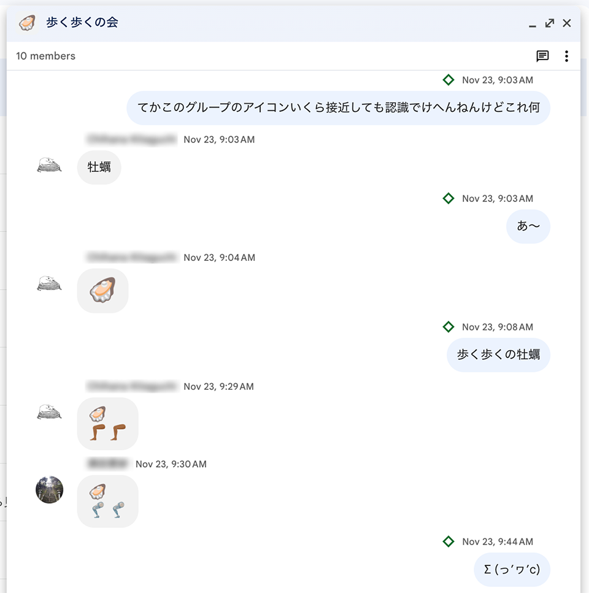
  <figcaption>こういう界隈</figcaption>
</figure>

実は地理の某先生と卒業後もご縁があり、Extended Super Saturdayを開催していただいたりとか（わりと何回もやっていただいた。ありがとうございます）、百粁のルートを使って歩いたりとか。稲田を筆頭とする若干名が夜あるきたい人なので、近頃は夜間徒歩を企画しがちです。

「近頃は」と言いましたが、調べたところ最近は年1ないし年2くらいのペースで、夜間でやったのも数えるくらいしかありませんでした。居場所が散逸したOBOGの活動なんてそんなもんである。実質的にはハウルの動く同窓会という感じです。

## 最近の様子

もっとも直近の開催では朝倉〜天理〜奈良（今年・北上）を、その前の回は西大寺〜奈良〜天理〜朝倉（去年・南下）の夜間徒歩を開催しました。参加する各期が共通して馴染みのあるコースとして、なんだかんだ山の辺の道に収束しがちです。

北上回は6人、南下回は4人が参加。参加者は58期〜61期くらいまでが中心で、広めに募ったりもしながらもやはり特別隊などの経験者が中心になりがちです。そして経験者チームともなるとやることが奔放で、参加スタイルが自由です。北上回では以下のようなケースがありました。

- 途中の断念ポイントから自力で合流（T氏@61期）
- 断念ポイントですらないところから勝手に道を開拓して合流（M氏@59期）
- 車で並走しながら行く先のRPごとで喋りに来る（I氏@60期）

南下回（去年）は運悪く雨予報が出ておりながらもとりあえず見切り発車でスタート。雨雲に追われながらもどうにか西大寺から奈良までは到着。奈良公園の東屋で、ここからどうするか……としばし検討会を開くも、雨雲の間を縫いながらまたも強硬出発。気象レーダーを凝視しながら屋根ありレストへの到着時刻を調整し、どうにか天理までかっ飛ばして始発で解散するエクストリーム回でした。

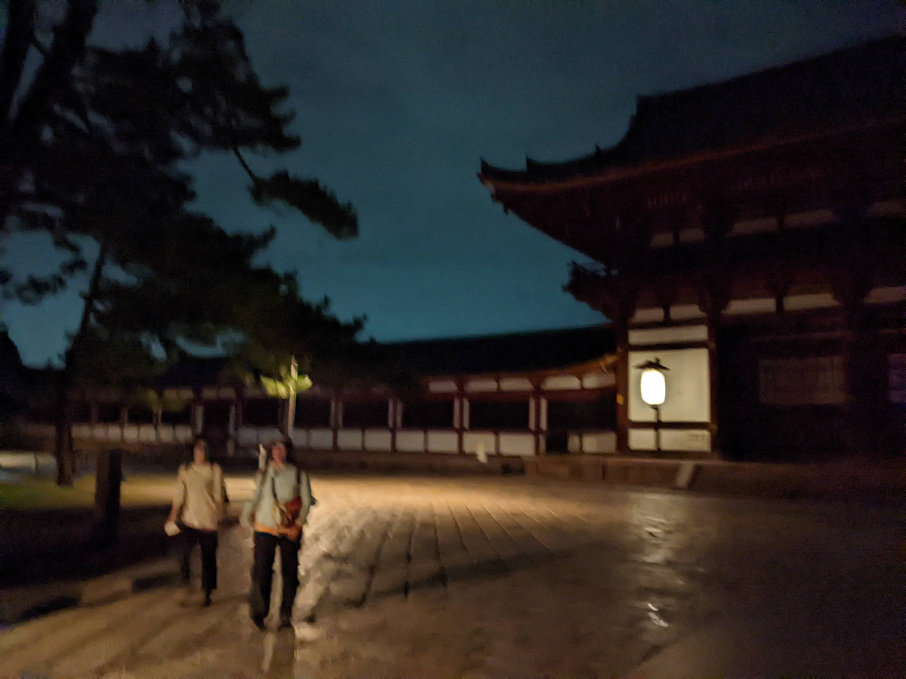

北上回（今年）は打って変わってものすごい好条件で、厳しくない気候に加えて満月前日であり、ライトなしでもほとんど歩けるような明るさでした。上述の通りメンバーがあっちこっちで出たり入ったりし、にぎやかで楽しい回だった印象です。タイムテーブルをみごと遵守したまま奈良まで到着し、始発近くで解散しました。

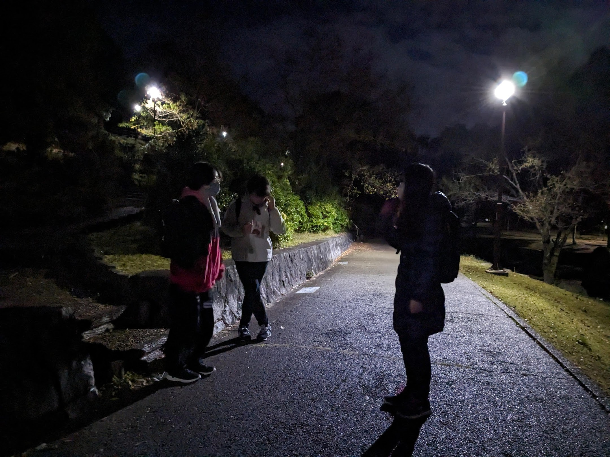

### 裏側

いくら経験者集団とはいえ夜間区はやはり人数が必要で、プラス稲田は関東から移動するのがそれなりに準備が必要なので、直前になって人数集まらなくてボツ！にならないようわりと念入りに根回ししてたりします。

<figure>
  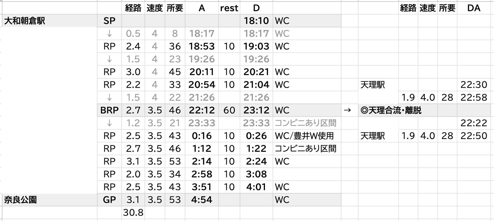
  <figcaption>北上回で使用したタイムテーブル。天理駅への離脱／合流を考慮した分岐ありの構成（一部のポイント名を隠しています）</figcaption>
</figure>

タイムテーブルやコースも人数を確保するため、最初から途中合流・途中離脱を想定して意図的に作っていたりします。このへんは個人的には、マップ隊をやっていた習性のままに楽しく作業しています。

## この10年で変わったことあれこれ

個人的には山の辺や関わる界隈とのお付き合いは非常に連続的であまり自覚することがなかったのですが、冷静に計算したところ、稲田が初めて山の辺の道に足を踏み入れてからそろそろ10年になるようです。なんということでしょう。

非常に安定している山の辺の道も、10年も経つと思ってもみなかった変化がいろいろあり面白いです。現役生がまだ使っているところなのですぐわかるような書き方は避けたいのですが、例えば:

- 天理市内の道が隣接する民家の擁壁崩落により通行止め
  - すぐ横に迂回路が案内されており問題なく通れた。さすがメジャーな徒歩道である。
- 奈良市内のI橋が護岸工事か何かで消失
  - 消えたのがどうもコロナ禍だったのか、南下回で知らずに突っ込んだところすでに前後の道がゆるやかに草むらに消えるようにしてなくなっており、真っ暗な中で道が消えていく恐怖を味わった。
- 奈良市内のレストポイントEが、ここでは言えない理由で使用不能に
  - 後世の有志たちが使用しているレストポイントGで代替。全然知らない道をマップ読みながら歩く新鮮な気持ちをひさびさに味わった。

<figure>
 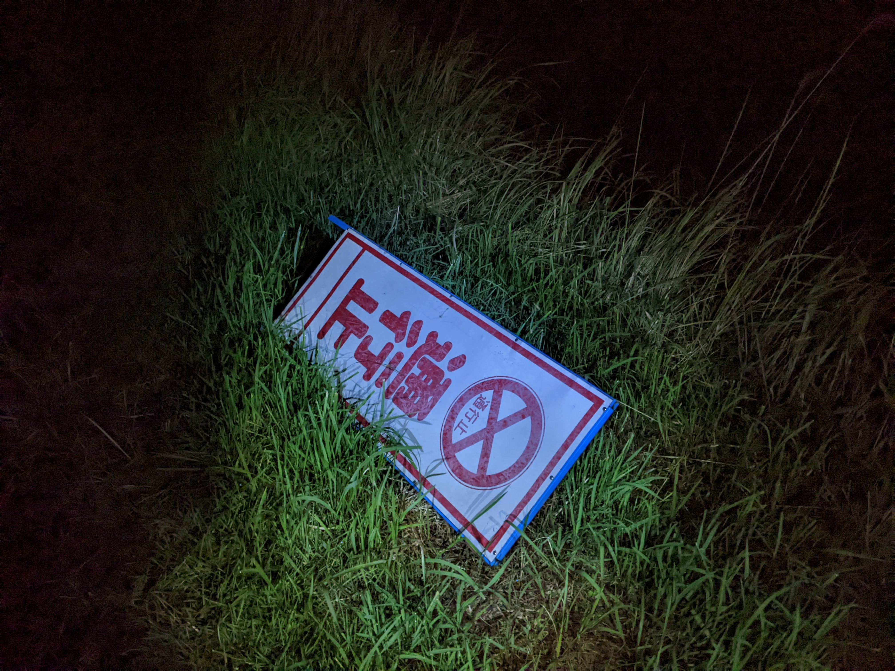
 <figcaption>I橋の手前の通行止め標識。今思えばこれをちゃんと見ろよという話だが、コケていたのでどこに向いてるのかがいまいち分からず……夜闇の中の懐中電灯で見る謎標識はなんとも言えず不気味だった</figcaption>
</figure>

歩く歩くの会メンバーをはじめとした関係者は、地図の明確な暗記ではないにせよ、曲がり角に立つと自然と進むべき道がわかる……というほどにはコースに慣れ親しんでいる人も多いようです。まるで家の近所のように記憶の残る場所がものすごい距離にわたって広がっている、細かな変化にも気付きとともに戻ってくる思い出がある、そして新しい場所を地図をにらみながら探検していく、というのは、実感してみないとわからない魅力があると思います。

<figure>
  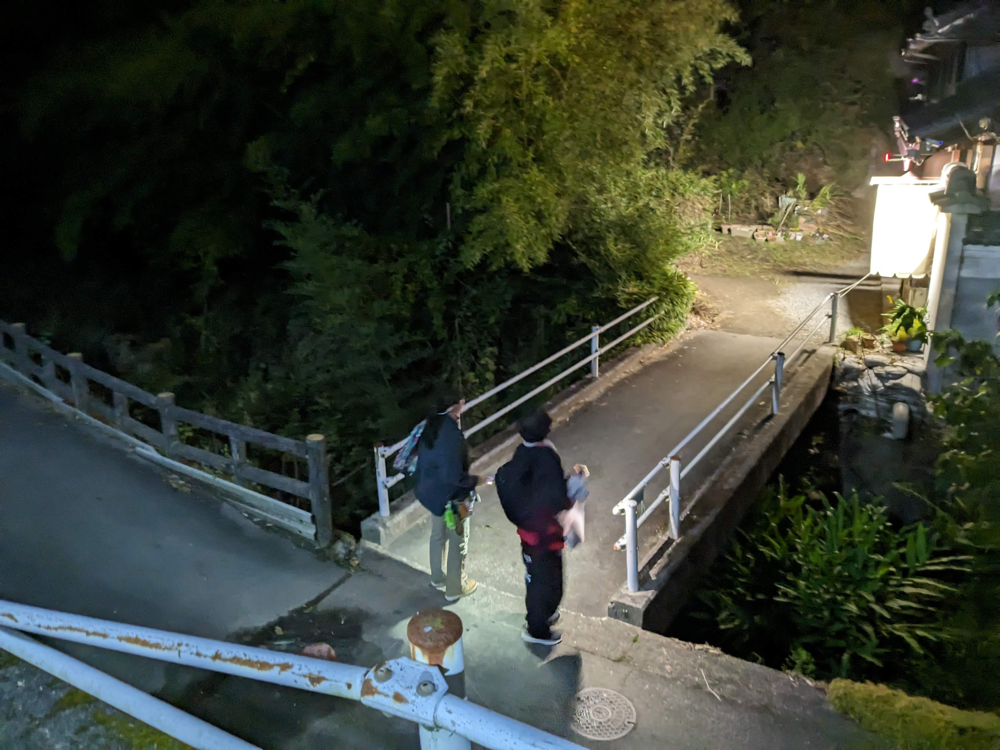
  <figcaption>Q. どこのポイントの近くでしょう。</figcaption>
</figure>

一方で、道よりも早く自分たちの身体と周辺環境が変わりそうな実感もあります……。高校卒業したての頃、一足先に卒業したある種伝説であった先輩が全コース踏破中に膝の痛みで断念したという話を聞いて、ずっとこういう事ができるわけではないのだと実感したり。自分もまだ元気であるとはいえ、全コースを歩き切れるかと言われるとやや微妙なところがあって夜間だけを企画しているというのもあり。

そもそもまだ身分としては学生で、自由に使える時間が多いからこういうことができているという見方もあります。いずれいままでのようには歩けなくなる時期が来るのだろうなと思っています。

今年の北上回、稲田は無謀にも一眼を持ち込みいろいろと写真撮影にチャレンジしました。夜間の雰囲気を記録に残すのは、現役当時からずっとやりたかったことです。これで急に歩けなくなっても悔いはありません……ね？ほんまか……？

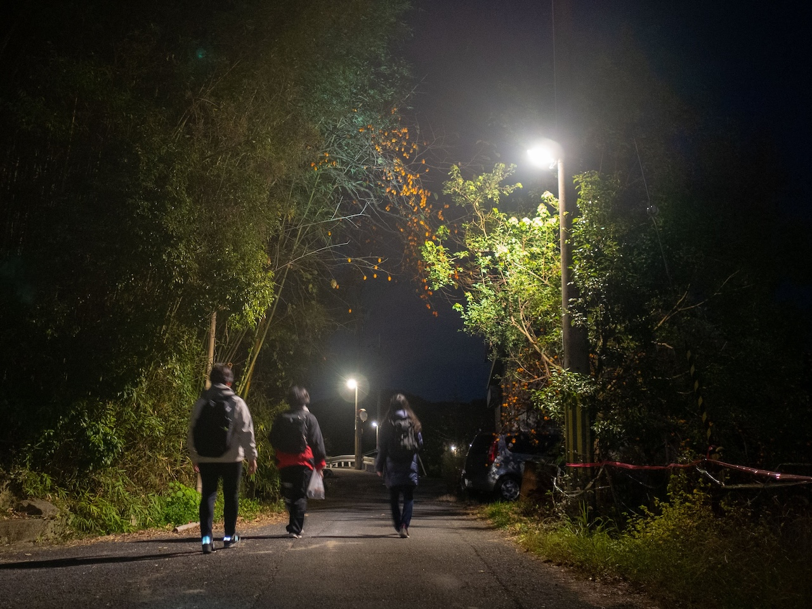

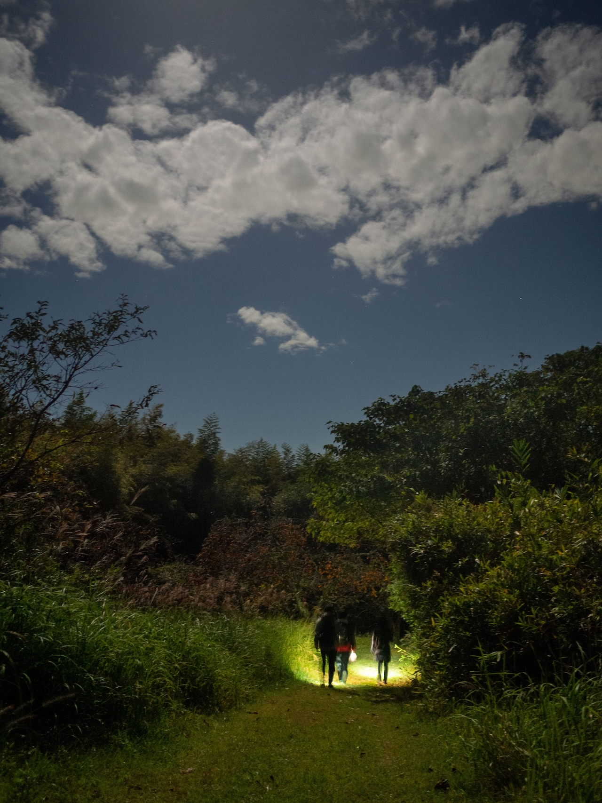

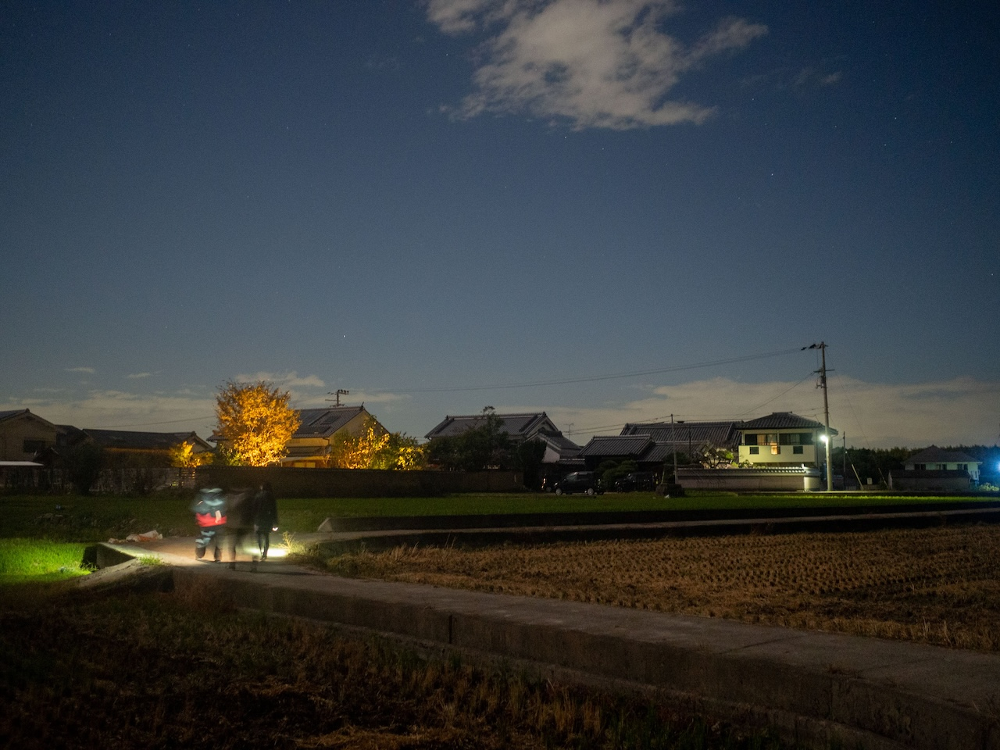

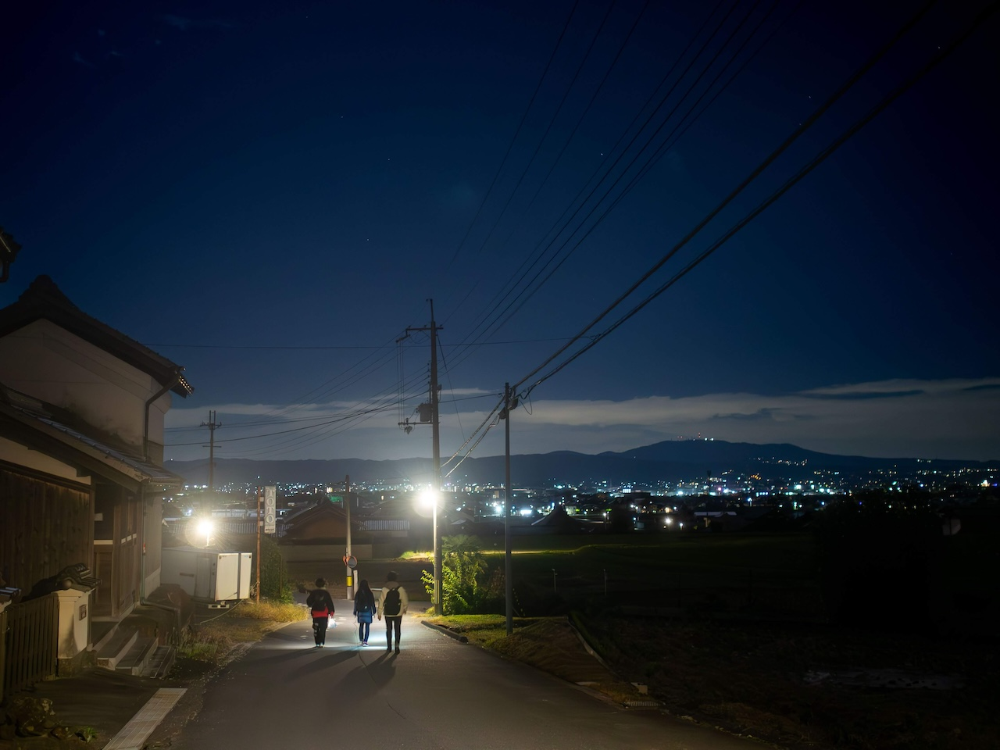

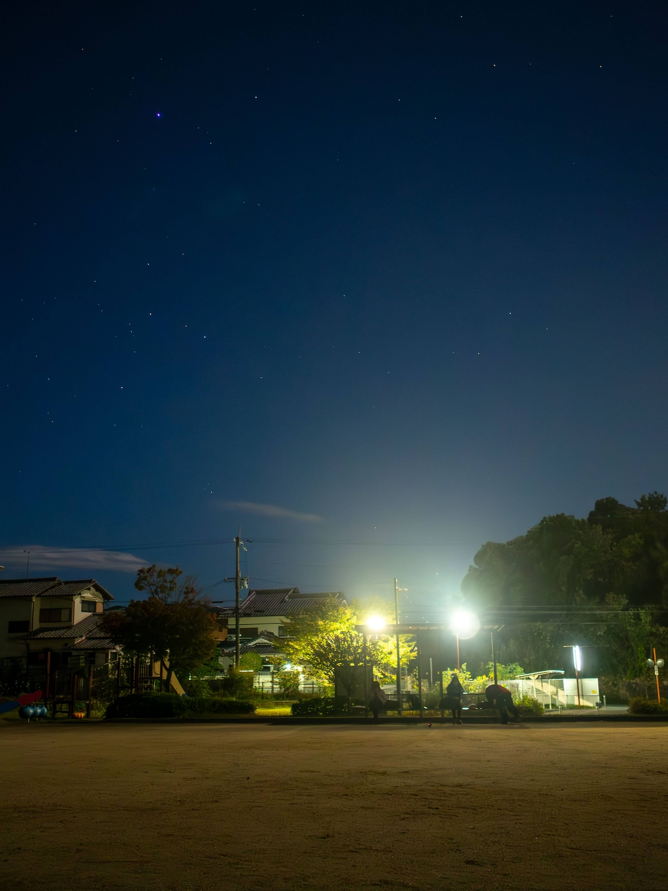

なにやら終了のお知らせのようになりましたが、諸々が許す限りは、まだまだ山の辺の道に通い続けたいと思います。徒歩案件のお誘いお待ちしていますし、歩く歩くの会世代が企画するお散歩会への参加も、所属期や経験の多寡を問わずお待ちしています[^1]。

明日はAFTAC運営のちんちゃん [`@ChinChanTwo`](https://twitter.com/ChinChanTwo/status/1727329091010138243) の記事です！お楽しみに！

[^1]: 徒歩案件の流通には65期ねぎまくん[`@negima_oden`](https://twitter.com/negima_oden)運営の附天生Discord・[百粁のFacebookグループ](https://www.facebook.com/groups/100kmwalking)・百粁関係のGoogleグループMLとかを活用すると良いのではないかと思います（稲田もこのへん+[附天生向けのXアカウント `@_nandenjin_`](https://twitter.com/_nandenjin_)で情報を流しています）。
